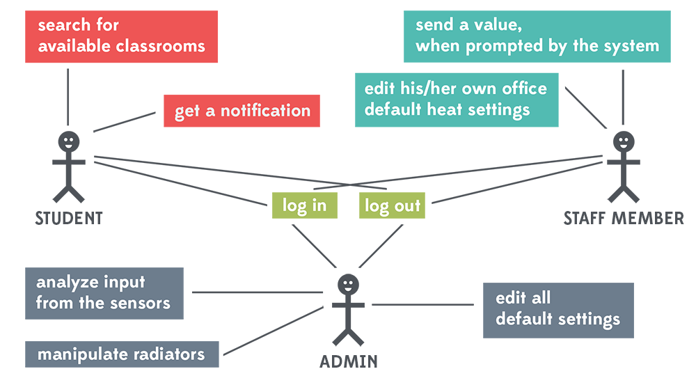

#Chapter 2. Use cases

###2.1. User group definitions

| USER GROUP      | DEFINITION           | DESCRIPTION  |
| ------------- |-------------| -----|
| Administrator / Admin     | The campus administrator          |   Has full access to school temperature control.|
| User / Student      | Registered user in school database     |   Comes to school on a regular basis. Has no execution authorities. |
| User / Staff member | Registered user in school database     |   Has his/her own room/office, where some temperature manipulations are possible by the user.  |

###2.2. Primary actors and use cases

| PRIMARY ACTOR        | USE CASES           |
| ------------- | ------------- |
| Admin      | <ol><li>Log in</li><li>Log out</li><li>Edit all default settings</li><li>Analyze input from the sensors</li><li>Manipulate radiators</li></ol>|
| Staff member     | <ol><li>Log in</li><li>Log out</li><li>Edit his/her own office default heat settings</li><li>Send a value, when prompted by the system</li></ol>      |
| Student | <ol><li>Log in</li><li>Log out</li><li>Search for available classrooms</li><li>Get a notification</li></ol>    |

---

 <table>
  <tr>
    <td>__USE CASE ID__</td>
    <td>1</td>
  </tr>
  <tr>
    <td>__USE CASE NAME__</td>
    <td>Edit all default settings</td>
  </tr>
  <tr>
    <td>__ACTOR__</td>
    <td>Admin</td>
  </tr>
  <tr>
    <td>__DESCRIPTION__</td>
    <td>The admin should be able to manipulate different control policies of default values</td>
  </tr>
  <tr>
    <td>__NORMAL FLOW__</td>
    <td>
     <ol>
      <li>Logs in</li>
      <li>Taps the "Global" icon on the bottom of the screen</li>
      <li>"Policies" tab appears</li>
      <li>Changes default temperatures by tapping pickers</li>
      <li>Saves the values</li>
      <li>Selects the "Time sets" tab</li>
      <li>"Time sets" tab appears</li>
      <li>Selects the day of the week from a dropdown menu</li>
      <li>Time sets for different periods are shown</li>
      <li>Taps "Settings" icon which is next to time set name</li>
      <li>Changes time values "From" and "To"</li>
      <li>Saves the values</li>
     </ol>
    </td>
  </tr>
  <tr>
    <td>__EXCEPTIONS__</td>
    <td>
     <ol>
      <li>No connection to database</li>
      <li>Previous time values of time sets are automatically overwritten by the last input. For example, if the last input for Monday is 00:00-24:00 for "Non-active time", then "Schedule time" and "Active time" get zero values — Monday would be fully non-active</li>
     </ol>
    </td>
  </tr>
  <tr>
    <td>__SPECIAL REQUIREMENTS__</td>
    <td>Admin can reset all the values</td>
  </tr>
</table> 

---

 <table>
  <tr>
    <td>__USE CASE ID__</td>
    <td>2</td>
  </tr>
  <tr>
    <td>__USE CASE NAME__</td>
    <td>Analyze input from the sensors</td>
  </tr>
  <tr>
    <td>__ACTOR__</td>
    <td>Admin</td>
  </tr>
  <tr>
    <td>__DESCRIPTION__</td>
    <td>Admin is able to read input values from heat sensor and location beacons</td>
  </tr>
  <tr>
    <td>__NORMAL FLOW__</td>
    <td>
     <ol>
      <li>Logs in</li>
      <li>Searches for the room through a search bar (or selects it by tapping the tabs(building and level))</li>
      <li>Taps settings icon which is next to room number</li>
      <li>New table appears, containing information about number of people and temperature</li>
     </ol>
    </td>
  </tr>
</table>

---

 <table>
  <tr>
    <td>__USE CASE ID__</td>
    <td>3</td>
  </tr>
  <tr>
    <td>__USE CASE NAME__</td>
    <td>Manipulate radiators</td>
  </tr>
  <tr>
    <td>__ACTOR__</td>
    <td>Admin</td>
  </tr>
  <tr>
    <td>__DESCRIPTION__</td>
    <td>The radiator inside the section of the building can be turned on/off remotely through the admin control panel. Additionally, the temperature can be changed through an actuator.</td>
  </tr>
  <tr>
    <td>__NORMAL FLOW__</td>
    <td>
     <ol>
      <li>Logs in</li>
      <li>Searches for the room through a search bar (or selects it by tapping the tabs(building and level))</li>
      <li>Taps settings icon which is next to room number</li>
      <li>New table appears, containing information about the status of the radiator and picker to manipulate the temperature value</li>
      <li>Turns the radiator on/off</li>
      <li>Changes teh temperature</li>
      <li>Saves new values</li>
     </ol>
    </td>
  </tr>
  <tr>
    <td>__EXCEPTIONS__</td>
    <td>The system will reset to its default setting values once it is operating on a different protocol</td>
  </tr>
</table>
